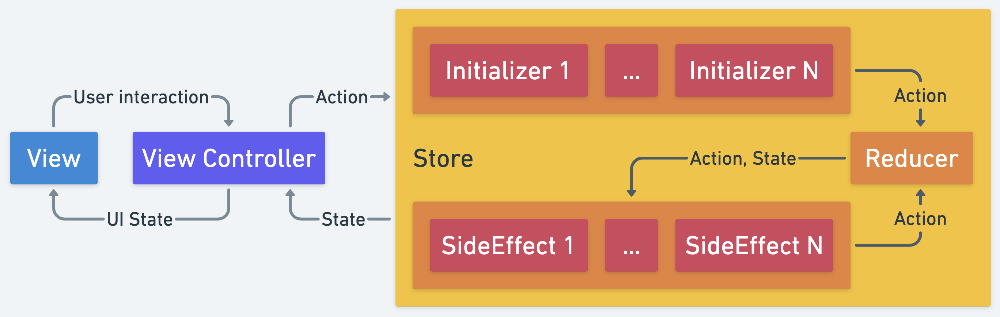

# Reduktor (WORK IN PROGRESS)

Библиотека помогает реализовать подход `Unidirectional Data Flow`. При таком подходе всё представляется в виде потока действий. Попадая в систему,
действие может изменить состояние, вызвать сайд-эффекты и породить другие действия. На выходе из системы получаем поток с актуальным состоянием,
которое можно отобразить в интерфейсе.

## Описание

Всё взаимодействие происходит через объект `Store`.

Какие параметры есть у `Store`:

- `initialState` - начальное состояние.
- `reducer` - сущность, которая преобразовывает новое действие и текущее состояние в новое состояние.
- `initializers` - сущности, которые могут постить действия из внешних источников. Вызываются сразу при создании `Store`.
- `sideEffects` - сущности, которые обрабатывают новое действие и текущее состояние. Могут общаться с внешними объектами и постить новые действия.
- `logger` - логгер. Получает сообщения с состоянием системы: какое действие пришло, какое сейчас состояние и какое получилось новое состояние (или
  что оно не изменилось).
- `newStatesCallback` - колбек, в который будет передаваться новое состояние.

Принцип работы:

- Действие может попасть в систему через `Initializer`. Это может быть событие от взаимодействия с пользователем или любое другое внешнее событие.
- Далее действие проходит через `Reducer`. Тут действие может повлиять на изменение состояния. Если состояние изменилось - оно будет отправлено тем,
  кто на него подписался.
- После этого действие и новое (либо не изменившееся) состояние попадают в `SideEffect`.
- В `SideEffect` можно создать новые действия и отправить их через объект `actions`. Они снова попадут в `Reducer` и `SideEffect`.
- Можно создавать и выполнять фоновые задачи, результатом работы которых становится новое действие. Для того, чтобы сохранять задачи и отменять их,
  в `SideEffect` есть доступ к `tasks`. Такая задача должна наследоваться от `Task`.
- Завершить выполнение работы и отменить все задачи можно через метод `release()`.



#### Dependencies

```groovy
dependencies {
    implementation 'com.github.g000sha256.reduktor:core:0.4'
}
repositories {
    maven { url 'https://jitpack.io' }
}
```

## Coroutines

Для `Coroutines` есть отдельный `Store`, который не принимает колбек, а имеет `StateFlow`, на который можно подписаться и получать состояния через
него. Так же, есть готовая реализация `Task` в виде экстеншена `.newTask` к `CoroutineScope`.

#### Dependencies

```groovy
dependencies {
    implementation 'com.github.g000sha256.reduktor:coroutines:0.4'
    implementation 'com.github.g000sha256.reduktor:core:0.4'
}
repositories {
    maven { url 'https://jitpack.io' }
}
```

## RxJava2

Для `RxJava2` есть отдельный `Store`, который не принимает колбек, а имеет `Flowable`, на который можно подписаться и получать состояния через него.
Так же, есть готовая реализация `Task` в виде экстеншена `.toTask` к различным видам стримов.

#### Dependencies

```groovy
dependencies {
    implementation 'com.github.g000sha256.reduktor:rxjava2:0.4'
    implementation 'com.github.g000sha256.reduktor:core:0.4'
}
repositories {
    maven { url 'https://jitpack.io' }
}
```

## RxJava3

Для `RxJava3` есть отдельный `Store`, который не принимает колбек, а имеет `Flowable`, на который можно подписаться и получать состояния через него.
Так же, есть готовая реализация `Task` в виде экстеншена `.toTask` к различным видам стримов.

#### Dependencies

```groovy
dependencies {
    implementation 'com.github.g000sha256.reduktor:rxjava3:0.4'
    implementation 'com.github.g000sha256.reduktor:core:0.4'
}
repositories {
    maven { url 'https://jitpack.io' }
}
```