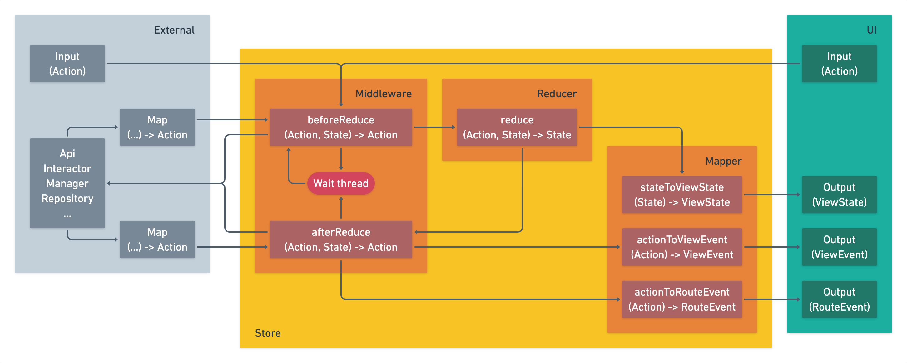

# Reduktor
[](https://github.com/g000sha256/reduktor/blob/master/License)

[](https://play.google.com/store/apps/details?id=ru.g000sha256.reduktor.demo)

`Reduktor` is a `Kotlin` library that makes Your application development faster and easier.

This library works with `RxJava` and helps implement the `Unidirectional Data Flow` pattern.

## Used libraries
* [Kotlin](https://github.com/JetBrains/kotlin)
* [RxJava 3](https://github.com/ReactiveX/RxJava)

## Structure
* `Mapper` - transforms action into route/view event, state into view state.
* `Middleware` - contains business logic. It is infinite `Observable`.
* `Reducer` - changes state with a new action.
* `StateAccessor` - contains the actual state.
* `Store` - main library class, which binds all components and contains actual states.

## Scheme of work


## Installation
```gradle
dependencies {
    implementation "com.github.g000sha256:reduktor:1.0.93"
}
repositories {
    maven { url "https://jitpack.io" }
}
```

## Usage
`Store` will save state, view state, executed tasks and "missed" route/view events.
If the router or view is unsubscribed then `Store` automatically saves all events until the subscription occurs again.
Use `saveEvents = true` for this.
This will not work if the process was killed.

You can enable logging using `enableLogs = true` and see all events and states.

Components can work in a separate thread.
To do this, pass the correct scheduler.
I recommend using a one thread scheduler from [SchedulersFactory](https://github.com/g000sha256/schedulers-factory).

```kotlin
private fun createStore(
        schedulersFactory: SchedulersFactory,
        bundle: Bundle?
): Store<MainAction, MainState, MainRouteEvent, MainViewEvent, MainViewState> {
    return Store(
            enableLogs = true,
            saveEvents = true,
            mapper = MainMapper(),
            middleware = MainMiddleware(),
            reducer = MainReducer(),
            scheduler = schedulersFactory.createOneThreadScheduler(),
            state = bundle?.getParcelable(KEY_STATE) ?: MainState()
    )
}
```

You can use `takeUntil` to cancel the task.
```kotlin
class MainMiddleware(
        private val repository: MainRepository
) : Middleware<MainAction, MainState> {

    override fun create(
            actionObservable: Observable<MainAction>,
            stateAccessor: StateAccessor<MainState>
    ): Observable<MainAction> {
        return actionObservable
                .flatMap {
                    when (it) {
                        is MainAction.StartLoading -> {
                            val stopObservable = actionObservable.ofType(MainAction.StopLoading::class.java)
                            return@flatMap repository
                                    .load()
                                    .takeUntil(stopObservable)
                                    .map<MainAction> { MainAction.Load.Data(it) }
                                    .onErrorReturn { MainAction.Load.Error(it) }
                                    .startWithItem { MainAction.Load.Loading() }
                        }
                        ...
                        else -> return@flatMap Observable.empty<MainAction>()
                    }
                }
    }

}
```

## Demo ([GitHub](https://github.com/g000sha256/reduktor/blob/master/source/demo), [Google Play](https://play.google.com/store/apps/details?id=ru.g000sha256.reduktor.demo))
An example is a simple `Android` application displaying a list of `GitHub` users.

### States:
* [MainState](https://github.com/g000sha256/reduktor/blob/master/source/demo/src/main/java/ru/g000sha256/reduktor/demo/screen/main/MainState.kt)
* [MainViewState](https://github.com/g000sha256/reduktor/blob/master/source/demo/src/main/java/ru/g000sha256/reduktor/demo/screen/main/MainViewState.kt)

### Actions and events:
* [MainAction](https://github.com/g000sha256/reduktor/blob/master/source/demo/src/main/java/ru/g000sha256/reduktor/demo/screen/main/MainAction.kt)
* [MainRouteEvent](https://github.com/g000sha256/reduktor/blob/master/source/demo/src/main/java/ru/g000sha256/reduktor/demo/screen/main/MainRouteEvent.kt)
* [MainViewEvent](https://github.com/g000sha256/reduktor/blob/master/source/demo/src/main/java/ru/g000sha256/reduktor/demo/screen/main/MainViewEvent.kt)

### Logic:
* [MainMapper](https://github.com/g000sha256/reduktor/blob/master/source/demo/src/main/java/ru/g000sha256/reduktor/demo/screen/main/MainMapper.kt)
* [MainMiddleware](https://github.com/g000sha256/reduktor/blob/master/source/demo/src/main/java/ru/g000sha256/reduktor/demo/screen/main/MainMiddleware.kt)
* [MainReducer](https://github.com/g000sha256/reduktor/blob/master/source/demo/src/main/java/ru/g000sha256/reduktor/demo/screen/main/MainReducer.kt)